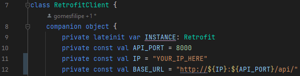

<link rel="stylesheet" href="https://cdnjs.cloudflare.com/ajax/libs/font-awesome/5.15.4/css/all.min.css">

#  📃 App Hush Hush

##  🤝 Authors:
* Elaine Dias Pires
*  Filipe Gomes Arante de Souza

##  🔎  About the app:

The Hush-Hush app is designed for individuals dealing with unresolved emotional, financial, and personal dilemmas. The goal is to provide a safe and welcoming space where these individuals can anonymously share and open up about their issues. This allows users who are interested in others' challenges to comment and engage in discussions on each of the topics, fostering a supportive community environment.
Our app is aimed at people between 20 and 50 years old, although individuals of all ages can access it.

You can see app prototype in :
https://www.canva.com/design/DAFyOQZp9vM/BDS0TVZ6yRE98M57J0cv6A/edit?utm_content=DAFyOQZp9vM&utm_campaign=designshare&utm_medium=link2&utm_source=sharebutton


##  🚀 Features:

### 📱  Register:

To register in app, you just need to create a username and password in register page and agree to terms of use in terms of use page.

### 📱  Login:

To login in app, you just have to enter your username and password on the login page and submit the form by clicking the login button

### 📱  Logout:

To logout of app, you just have to click in logout button in the bottom of app and confirm that your are sure that you want to logout.

### 📱  Create a hush-hush post:

To create a hush-hush, you just have to click in "plus icon" in menu and then you'll be redirect to another page when you can write your post and submit in submit button.

### 📱  Comment in another person hush-hush:
To comment in another person hush-hush post, you just have to go to the bottom  of hush-hush page, make your comment in input text area and click in icon of send in the right side of input.

### 📱  Likes/dislikes in other people's Hush-Hush posts:
To like/dislike a hush-hush post, you just have to click in "like icon" or "dislike icon" in hush-hush post.

### 📱  Filter hush-hush posts in home by title:
To filter Hush-Hush posts, you just have to go to the home page.
Path: "Login --> Home Page"
Select the search input at the top of the page and enter part of the title or the entire title of the Hush-Hush you want to read about.

### 📱 See it own profile:
To see your own profile, you just have to click in "profile icon" in menu at the bottom of any page when you're logged.

## 🚀 Technologies:
* PHP, using Laravel Framework to develop the API. To see more about, access:
  https://github.com/mobile-dev-ufes/2023-2-proj-final-hush-hush-api

* Kotlin in android app.


## 💻 Instalation:
To run the app, it's necessary to run the API, follows the docs at: https://github.com/mobile-dev-ufes/2023-2-proj-final-hush-hush-api

Then, clone the current repository in your local machine and open it in android studio. Navigate to class RetrofitClient and change the ip to your ip in line 11:



To capture your ip, use command:

```
$ ifconfig
```

Finally, just run the app as usual in android studio.

## 📹 Video:
To see the app presentation video on Youtube: <a href="https://youtu.be/XA4-tjm_yyM">https://youtu.be/XA4-tjm_yyM</a>
